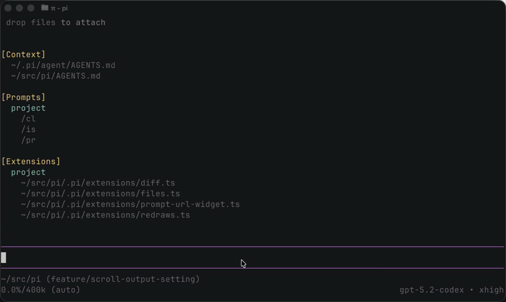

<p align="center">
  <a href="https://shittycodingagent.ai">
    
  </a>
</p>
# Tinny Pi (Continua Edition of Pi)

> **Looking for the pi coding agent?** See **[packages/coding-agent](packages/coding-agent)** for installation and usage.

Tools for building AI agents and managing LLM deployments.

## Continua Edition (tinny-pi)

We use Tinny Pi internally at Continua AI. We love Mario’s minimalist pi and stay close to upstream while pushing on ambitious UI work that may not fit the minimalist mold but can improve usability for some workflows. Expect opt-in toggles and a bias toward upstream compatibility.

### Highlights (so far)

- **Output-only scroll mode**: keeps the editor/footer pinned while you scroll output, so you can read agent questions and type at the same time.
  - Toggle with `ctrl+shift+m`, `/settings`, or `terminal.scrollOutputOnly` in `~/.tinny-pi/agent/settings.json`.
- **Tinny-pi branding + config paths**: the CLI is `tinny-pi`, and config lives in `~/.tinny-pi/agent` on the `continua` branch.

### Try it

```bash
# Clone + switch to the Continua edition
git clone https://github.com/continua-ai/tinny-pi
cd tinny-pi
git checkout continua

# Install deps + build
npm install
npm run build

# Install the CLI (registers the tinny-pi binary)
npm install -g ./packages/coding-agent

# Run
export ANTHROPIC_API_KEY=...   # or /login inside the app
tinny-pi
```

1. Ask for a long response (or run `!find . -type f`).
2. Scroll with the mouse wheel — the editor/footer should stay pinned.
3. Toggle on/off with `ctrl+shift+m`.

If you use tmux, enable mouse forwarding:

```tmux
set -g mouse on
```

### Demo: output-only scroll

[](docs/media/output-only-scroll.mp4)

## Continua Support

- GitHub issues: https://github.com/continua-ai/tinny-pi/issues

## Packages

| Package | Description |
|---------|-------------|
| **[@mariozechner/pi-ai](packages/ai)** | Unified multi-provider LLM API (OpenAI, Anthropic, Google, etc.) |
| **[@mariozechner/pi-agent-core](packages/agent)** | Agent runtime with tool calling and state management |
| **[@mariozechner/pi-coding-agent](packages/coding-agent)** | Interactive coding agent CLI |
| **[@mariozechner/pi-mom](packages/mom)** | Slack bot that delegates messages to the pi coding agent |
| **[@mariozechner/pi-tui](packages/tui)** | Terminal UI library with differential rendering |
| **[@mariozechner/pi-web-ui](packages/web-ui)** | Web components for AI chat interfaces |
| **[@mariozechner/pi-pods](packages/pods)** | CLI for managing vLLM deployments on GPU pods |

## Upstream Resources

- Upstream repo: https://github.com/badlogic/pi-mono
- Upstream Discord: https://discord.com/invite/3cU7Bz4UPx
- Upstream CI: https://github.com/badlogic/pi-mono/actions/workflows/ci.yml

## Contributing

See [CONTRIBUTING.md](CONTRIBUTING.md) for contribution guidelines and [AGENTS.md](AGENTS.md) for project-specific rules (for both humans and agents).

## Development

```bash
npm install          # Install all dependencies
npm run build        # Build all packages
npm run check        # Lint, format, and type check
./test.sh            # Run tests (skips LLM-dependent tests without API keys)
./pi-test.sh         # Run pi from sources (must be run from repo root)
```

> **Note:** `npm run check` requires `npm run build` to be run first. The web-ui package uses `tsc` which needs compiled `.d.ts` files from dependencies.

## License

MIT